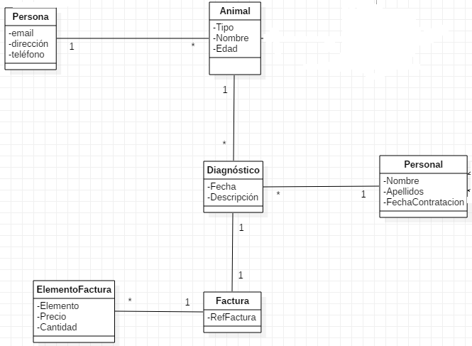

# API Veterinaria

> Create an API to keep track of a veterinary.

## Built With

- Django
- Django Rest Framework
- Cors



## Getting Started

To get a local copy up and running follow these simple example steps.

### Dependencies
Python 3
Django

### Usage
```shell
python3 -m venv .env
.env\Scripts\activate
pip install -r requirements.txt
pip freeze
```

```python
python manage.py makemigrations
python manage.py migrate
python manage.py runserver
```

## SuperUser
```shell
python manage.py createsuperuser
```
